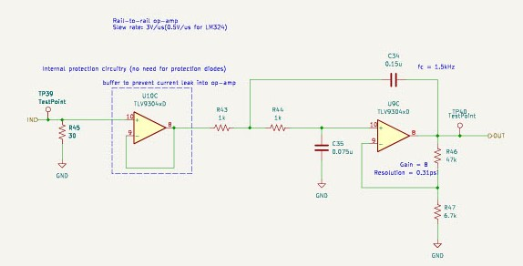
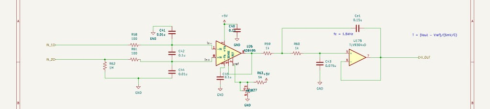

# kARCA 2.0 Main Documentation

This document highlights the features and design choices of kARCA 2.0 as a reference for future work on the project.

## Project Overview
kARCA 2.0 is an engine control system  that is part of Rice Eclipse's Engine Testing Setup. The controller interfaces directly with the engine through the controller software `slonk`, which runs on the Raspberry Pi. The user interfaces with the controller using a frontend JavaScript dashboard `Quonkboard` from which they can visualize the data collected and send commands to actuate valves and start the ignition sequence.

## System Requirements
1. Collect data from 4 load cells, pressure transducers, and thermocouples at a 5kHz samplingfrequency
2. Control the 600W ignition system by driving an external two-stage relay
3. Control 5 valves, each drawing up to 1A of current at 12V
4. Monitor Battery voltage and current
5. Transmit real time data to the user

## Design Outline

### Power Distribution

The main power source is a 12V Lead-Acid Battery, which is spliit into 5V and 12V lines.

The 12V line is used for the drivers, ignition circuitry, and the pressure transducers.

The 5V line is used for the remaining ciruitry. It is supplied by a DC-DC Power converter module, which is essentially a low-noise switching coverter. This minimizes power dissipation while reducing switching noise.

The battery current is monitored using a current shunt and a current sense amplifier. The voltage is monitored using a simple resistive divider circuit.

### Load Cell Data Collection
When supplied with an excitation voltage of 5V, the cell outputs a differential voltage proportonal to the applied force:
$$V_{dm} = \frac{V_{FSO}}{F_{FSO}}V_{DD}F$$
Where:
1. $V_{dm}$ is the output differential voltage
2. $V_{FSO}$ is the load cell's full scale voltage output: 3mV per volt of excitation when 3000lbf is applied
3. $V_{DD}$ is the exccitation voltage(5V in this case)
4. $F$ is the applied force

$V_{dm}$ is amplified using an instrumentation amplifier to obtain a single-ended readable signal (compatible with the ADC voltage resolution of 1.22mV). A two-pin jumper can be used to select the gain resistor connected to the instrumentation amplifier. A gain of 250 for the Titan load cell or a gain of 17 for the Proxima load cell can be chosen.

The single-ended signal is then filtered using a unity-gain active filter with a cutoff frequency of $1.5kHz$. This is to prevent aliasing during sampling.

### Pressure Transducer Data Collection
A pressure transducer is a 4-20mA device. It outputs a current that varies linearly with the measured pressure (4mA corresponds to 0 psig; 20mA corresponds to 1000psig). It usually consists of a wheatstone bridge circuit like a load cell and a current loop transmitter that converts the voltage to a current. The current signal provides stronger noise immunity. 

The signal is converted back to a voltage using a $30\Omega$ shunt resistor. This results in a voltage range of 0.12V to 0.6V. A low shunt resistance is necessary to minimize the voltage drop as the pressure transducers need a minimum of 8V to operate.

The signal is amplified with a gain of 8 using an active filter with a cutoff frequency of $1.5kHz$. Therefore the full voltage range is from 0.96V to 4.8V, corresponding to a resolution of 0.31psi.

To minimize the possibility of power supply noise and fluctuations affecting the circuit, the powersupply from the battery is regulated using a Low Dropout Regulator.

### Thermocouple Data Collection
Thermocouples output a very small voltage signal that is proportional to the temperature difference between the measurement junction and a reference junction.
 ($5mV/^{\\circ}C$). This differential signal is amplified by the AD8495 Thermocouple amplifier with a gain of 122.4. The output voltage is thus:
 $$V_{out} = (T_{measured}\cdot mV/^{\\circ}C)\cdot 122.4$$

 

 ### Valve Actuation
 Each valve is driven by the IRF3708 mosfet. These mosfets have a very low drain-source resistance, allowing sufficient current to flow when then gate is driven by 3.3V from the 
 Raspberry Pi GPIO. There are also green status LEDs that light up, when a valve is actuated.

 

 To ensure that the valve actuates when the driver is turned on, the current through the valve is measured using current sense amplifiers and shunt resistors.
 

 ### Board Layout
 The board is 25cm x 14.5cm since space wasn't a major concern. Components were grouped according to their function and were spaced out since being able to modify traces and easily replace components by hand were priorities.

 The board consists of 4 layers: SIGNAL-GND-PWR-SIGNAL. This keeps the signal traces close to a reference plane. The power plane is much simpler than that of the original kARCA design; it only consists of a single 5V plane and the 12V is supplied using traces. This prevents potential signal deterioration due to signals crossing split power planes.

 All the components are mounted on the top layer.

 
 
